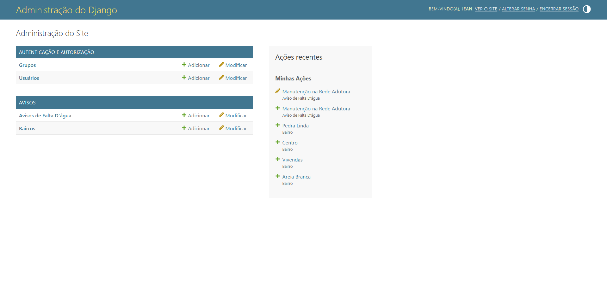

# Projeto Pessoal - Monitoramento de Abastecimento (Petrolina-PE)

Novas atualizações futuramente!

Esse projeto é uma atividade que me foi pedida uma vez em uma entrevista de estágio, gostaria de compartilhar ela aqui para demonstração de minha evolução na linguagem Python. 13/04/2026

Sistema desenvolvido para centralizar e divulgar avisos de interrupção no fornecimento de água para os bairros de Petrolina. O projeto foca em leitura rápida e gerenciamento simplificado.

## - Funcionalidades

- **Painel Administrativo:** Gestão de bairros e avisos com filtros de busca.
- **Relacionamento Many-to-Many:** Um único aviso pode ser vinculado a múltiplos bairros simultaneamente.
- **Controle de Status:** Diferenciação entre rascunhos e avisos publicados.

## - Tecnologias Utilizadas

- **Python 3.x**
- **Django Framework** (Backend e Admin)
- **SQLite** (Banco de dados local)
- **HTML5 / CSS3** (Front-end personalizado)

## - Como rodar o projeto localmente

Se o seu GitHub estivesse com 100% dos arquivos, o passo a passo é este:

    git clone [link-do-repositorio]

    python -m venv venv e ativar a venv.

    pip install django

    python manage.py runserver
